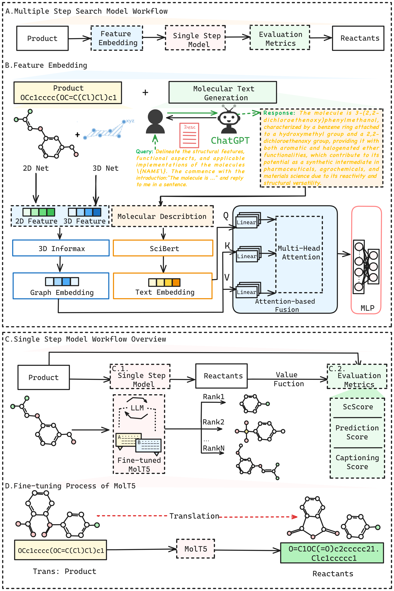

# RetroInText

## Abstact
Development of robust and effective strategies for retrosynthetic planning requires a deep understanding of the synthesis process. A critical step in achieving this goal is accurately identifying synthetic intermediates. Current machine learning-based methods often overlook the valuable context from the overall route, focusing only on predicting reactants from the product, requiring cost annotations for every reaction step, and ignoring the multi-faced nature of molecular, resulting in inaccurate synthetic route predictions. Therefore, we introduce RetroInText, an advanced end-to-end framework based on a multimodal Large Language Model (LLM), featuring in-context learning with TEXT descriptions of synthetic routes. First, RetroInText including ChatGPT presents detailed descriptions of the reaction procedure. It learns the distinct compound representations in parallel with corresponding molecule encoders to extract multi-modal representations including 3D features. Subsequently, we propose an attention-based mechanism that offers a fusion module to complement these multi-modal representations with in-context learning and a fine-tuned language model for a single-step model. As a result, RetroInText accurately represents and effectively captures the complex relationship between molecules and the synthetic route. In experiments on the USPTO pathways dataset RetroBench, RetroInText outperformed state-of-the-art methods, achieving up to a 5% improvement in Top-1 test accuracy, particularly for long synthetic routes. These results demonstrate the superiority of RetroInText by integrating with context information over routes. They also demonstrate its potential for advancing pathway design and facilitating the development of organic chemistry.



## Dependencies
The package depends on the Python==3.8.19:
```bash
dgl==2.1.0
einops==0.7.0
pandas==2.0.3
torch==2.2.0
torch-geometric==2.5.2
torch-scatter==2.1.2
torch-sparse==0.6.18
transformers==4.39.3
scikit-learn==1.3.2
```

We also provide the environment.yaml, you can create the environment below.
```bash
conda env create -f environment.yaml
```

## Dataset
We use the RetroBench dataset, you can find them in the data directory. You should download the trainning dataset and zinc_stock_17_04_20 file at the following link: [https://zenodo.org/records/14915184](https://zenodo.org/records/14915184) and put them in the folder ```./data```.

## Fine tune MolT5 
You should download the origin MolT5 model before fine-tuning it at [here](https://huggingface.co/laituan245/molt5-base), then put it at the run_translation folder, and save the checkpoint in the model directory.

```bash
cd run_translation

# The checkpoint of MolT5 should be saved in the model directory.
python run_translation.py --Fine-tune.txt
```
You also can download the MolT5 model we used [here](https://drive.google.com/drive/folders/15qYBvDtfoWtVteaxav14VrPCBVQwRWBa).

## Model Training
You should download the Scibert model before testing at [here](https://github.com/allenai/scibert), and choose the first one in PyTorch HuggingFace Models, then put it in the model directory. Download the train_dataset and the zinc_stock_17_04_20 file [here](https://drive.google.com/drive/folders/15qYBvDtfoWtVteaxav14VrPCBVQwRWBa).

```bash
# Data process

python to_canilize.py --dataset train
python to_canolize.py --dataset test

# Retro Star Zero Search
python retro_star_0.py  --beam_size 5

# Retro Star Search w/o text in test phase
python get_reaction_cost.py
python get_cost.py
python fusion_data.py
python MLP-text.py
#We also provide value_function_mlp.pkl, you can skip the above commands
python retro_star_molt5-mlp.py

# Retro Star Search w/o text in test phase
python get_reaction_cost.py
python get_cost.py
python Fusion_model.py
#We also provide value_function_fusion-model.pkl, you can skip the above commands
python retro_star_molt5.py
```

## Reference  
FusionRetro: https://github.com/SongtaoLiu0823/FusionRetro  
3DInfomax: https://github.com/HannesStark/3DInfomax  
MolT5: https://github.com/blender-nlp/MolT5  
Scibert: https://github.com/allenai/scibert  
